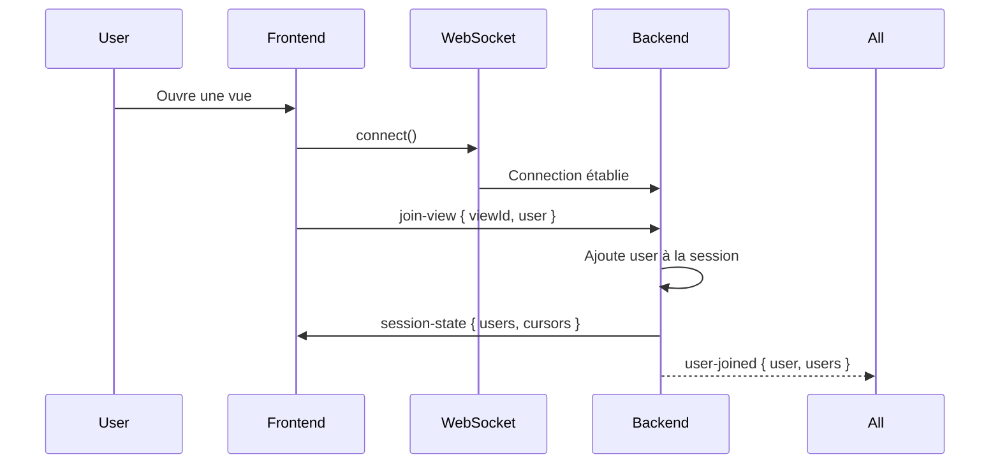
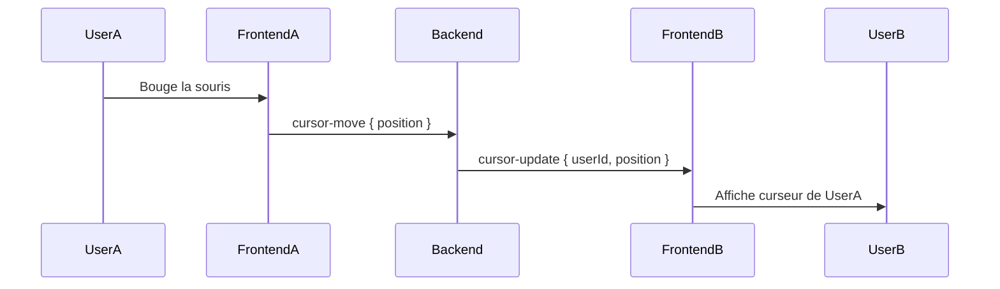
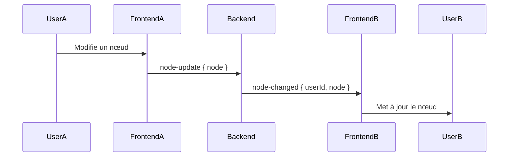

# Collaboration en Temps Réel - Documentation

## Vue d'ensemble

ArchiModeler implémente maintenant un système complet de **collaboration en temps réel** permettant à plusieurs utilisateurs de travailler simultanément sur les mêmes vues de modélisation, avec synchronisation instantanée des modifications.

## Fonctionnalités

### ✅ Implémenté

#### 1. **Système d'onglets multiples**
- Ouvrir plusieurs vues simultanément dans des onglets
- Basculer entre les vues ouvertes
- Fermer des onglets individuels
- Créer de nouvelles vues avec le bouton "+"

#### 2. **Collaboration en temps réel**
- **WebSocket** pour communication bidirectionnelle
- Synchronisation instantanée des modifications
- Gestion de la présence des utilisateurs
- Curseurs collaboratifs affichant la position des autres utilisateurs

#### 3. **Indicateurs visuels**
- **Curseurs colorés** avec nom d'utilisateur
- **Liste des utilisateurs actifs** dans la vue
- **Indicateur de connexion** (connecté/déconnecté)
- **Badge de nombre d'utilisateurs** dans la barre d'outils

## Architecture

### Backend (NestJS)

#### WebSocket Gateway

**Fichier**: `apps/server/src/collaboration/collaboration.gateway.ts`

Le gateway gère :
- Connexion/déconnexion des utilisateurs
- Gestion des sessions par vue
- Broadcasting des événements aux utilisateurs connectés

**Événements supportés** :
- `join-view` - Rejoindre une vue
- `leave-view` - Quitter une vue
- `cursor-move` - Mouvement du curseur
- `node-update` - Mise à jour d'un nœud
- `edge-update` - Mise à jour d'une relation
- `node-delete` - Suppression d'un nœud
- `edge-delete` - Suppression d'une relation
- `selection-change` - Changement de sélection

#### Module de Collaboration

**Fichier**: `apps/server/src/collaboration/collaboration.module.ts`

Module NestJS qui encapsule le gateway et ses dépendances.

### Frontend (Next.js)

#### Hook de Collaboration

**Fichier**: `apps/web/hooks/useCollaboration.ts`

Hook React personnalisé qui :
- Établit la connexion WebSocket
- Gère l'état de collaboration (utilisateurs, curseurs)
- Fournit des méthodes pour émettre des événements
- Écoute les événements des autres utilisateurs

**Utilisation** :
```tsx
const {
  users,
  cursors,
  isConnected,
  updateCursor,
  updateNode,
  updateEdge,
  deleteNode,
  deleteEdge,
} = useCollaboration({
  viewId: 'view-123',
  user: currentUser,
  onNodeChanged: (data) => { /* ... */ },
  onEdgeChanged: (data) => { /* ... */ },
});
```

#### Store d'Onglets

**Fichier**: `apps/web/store/useTabsStore.ts`

Store Zustand pour gérer les onglets :
```tsx
const { tabs, activeTabId, addTab, removeTab, setActiveTab } = useTabsStore();
```

#### Composants

1. **ViewTabs** (`components/studio/ViewTabs.tsx`)
   - Barre d'onglets pour naviguer entre les vues
   - Bouton pour créer de nouveaux onglets

2. **CollaborativeCanvas** (`components/canvas/CollaborativeCanvas.tsx`)
   - Wrapper autour de ModelingCanvas
   - Intègre le hook de collaboration
   - Affiche les curseurs collaboratifs

3. **CollaborativeCursors** (`components/collaboration/CollaborativeCursors.tsx`)
   - Affiche les curseurs des autres utilisateurs
   - Montre le nom et la couleur de chaque utilisateur

4. **ActiveUsers** (`components/collaboration/ActiveUsers.tsx`)
   - Popover affichant la liste des utilisateurs actifs
   - Indicateur de statut de connexion

## Configuration

### Installation des dépendances

**Backend** :
```bash
cd apps/server
npm install @nestjs/websockets @nestjs/platform-socket.io socket.io
```

**Frontend** :
```bash
cd apps/web
npm install socket.io-client
```

### Configuration du serveur WebSocket

Le serveur WebSocket est configuré pour écouter sur le namespace `/collaboration` :

```typescript
@WebSocketGateway({
  cors: {
    origin: '*',
  },
  namespace: 'collaboration',
})
```

**URL de connexion** : `http://localhost:3002/collaboration`

## Utilisation

### Ouvrir plusieurs vues

1. Accéder au Studio : `/studio?packageId=xxx`
2. Cliquer sur le bouton **"+"** dans la barre d'onglets
3. Une nouvelle vue s'ouvre dans un nouvel onglet
4. Basculer entre les onglets en cliquant dessus
5. Fermer un onglet avec le bouton **"X"**

### Collaboration multi-utilisateurs

1. **Utilisateur A** ouvre une vue dans le Studio
2. **Utilisateur B** ouvre la même vue (même `viewId`)
3. Les deux utilisateurs voient :
   - Le nombre d'utilisateurs actifs dans le badge
   - Les curseurs des autres utilisateurs en temps réel
   - Les modifications synchronisées instantanément

### Voir les utilisateurs actifs

1. Cliquer sur le badge **utilisateurs** (icône avec nombre)
2. Un popover s'affiche avec :
   - Statut de connexion
   - Liste des utilisateurs actifs
   - Couleur assignée à chaque utilisateur

## Flux de données

### Connexion à une vue



### Mouvement de curseur



### Modification d'un nœud



## Gestion des couleurs utilisateur

Chaque utilisateur se voit attribuer une couleur aléatoire parmi une palette prédéfinie :

```typescript
const colors = [
  '#FF6B6B', '#4ECDC4', '#45B7D1', '#FFA07A', 
  '#98D8C8', '#F7DC6F', '#BB8FCE', '#85C1E2',
  '#F8B739', '#52B788', '#E76F51', '#2A9D8F'
];
```

Cette couleur est utilisée pour :
- Le curseur de l'utilisateur
- Le badge dans la liste des utilisateurs actifs

## Améliorations futures

### 🔄 À implémenter

1. **Authentification réelle**
   - Utiliser les vrais noms d'utilisateur depuis le système d'auth
   - Avatars des utilisateurs

2. **Synchronisation complète**
   - Synchroniser les ajouts/suppressions de nœuds
   - Synchroniser les ajouts/suppressions de relations
   - Gestion des conflits (Operational Transformation ou CRDT)

3. **Indicateurs de sélection**
   - Afficher quels éléments sont sélectionnés par chaque utilisateur
   - Highlighting des éléments en cours d'édition

4. **Chat intégré**
   - Communication textuelle entre utilisateurs
   - Notifications de modifications importantes

5. **Historique et Undo/Redo collaboratif**
   - Historique partagé des modifications
   - Undo/Redo qui respecte les modifications des autres

6. **Permissions granulaires**
   - Lecture seule vs édition
   - Verrouillage d'éléments en cours d'édition

7. **Optimisations**
   - Throttling des événements de curseur
   - Compression des données WebSocket
   - Reconnexion automatique améliorée

8. **Persistance**
   - Sauvegarder automatiquement les modifications
   - Synchroniser avec la base de données

## Dépannage

### Le WebSocket ne se connecte pas

**Vérifier** :
1. Le serveur backend est démarré : `npm run start:dev` dans `apps/server`
2. Le port 3002 est accessible
3. Les CORS sont correctement configurés

### Les curseurs ne s'affichent pas

**Vérifier** :
1. Le hook `useCollaboration` est bien appelé
2. Le composant `CollaborativeCursors` est rendu
3. La console pour voir les événements WebSocket

### Les modifications ne se synchronisent pas

**Vérifier** :
1. Les événements sont bien émis (`updateNode`, `updateEdge`, etc.)
2. Les callbacks `onNodeChanged`, `onEdgeChanged` sont implémentés
3. La logique de mise à jour du state React Flow

## Ressources

- [Socket.IO Documentation](https://socket.io/docs/v4/)
- [NestJS WebSockets](https://docs.nestjs.com/websockets/gateways)
- [React Flow](https://reactflow.dev/)
- [Zustand](https://github.com/pmndrs/zustand)

## Tests

### Test manuel

1. Ouvrir deux navigateurs (ou fenêtres en navigation privée)
2. Se connecter avec des comptes différents dans chaque navigateur
3. Ouvrir la même vue dans les deux navigateurs
4. Vérifier que :
   - Les deux utilisateurs apparaissent dans la liste
   - Les curseurs sont visibles
   - Les modifications sont synchronisées

### Test de charge

Pour tester avec plusieurs utilisateurs :
```bash
# Simuler 10 utilisateurs
for i in {1..10}; do
  open "http://localhost:3000/studio?packageId=test"
done
```

## Sécurité

### ⚠️ Points d'attention

1. **Authentification** : Actuellement, les utilisateurs ne sont pas authentifiés au niveau WebSocket
2. **Autorisation** : Pas de vérification des permissions sur les vues
3. **Validation** : Les données reçues doivent être validées côté serveur
4. **Rate limiting** : Implémenter pour éviter le spam d'événements

### 🔒 Recommandations

1. Ajouter un middleware d'authentification au gateway
2. Vérifier les permissions avant de joindre une vue
3. Valider toutes les données entrantes
4. Implémenter du rate limiting sur les événements fréquents (curseur)
5. Chiffrer les communications sensibles
