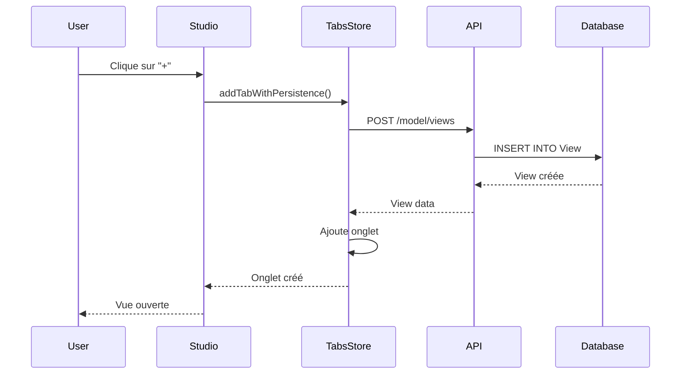
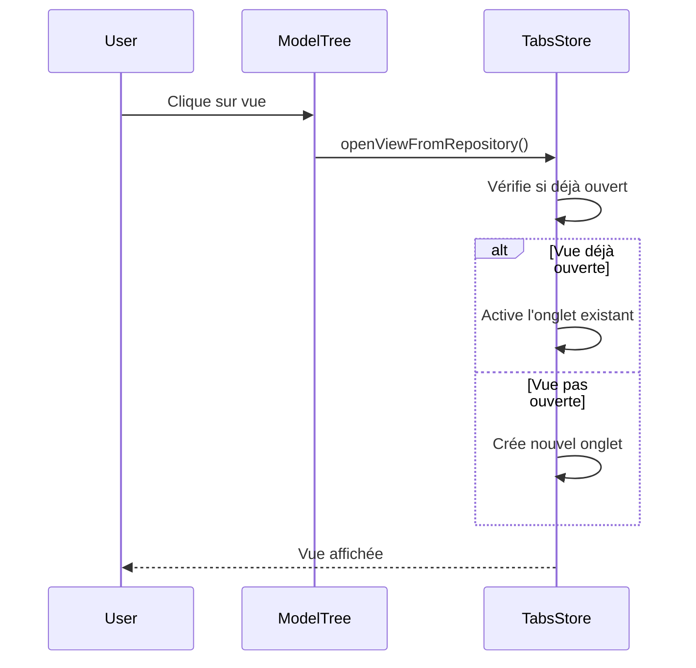
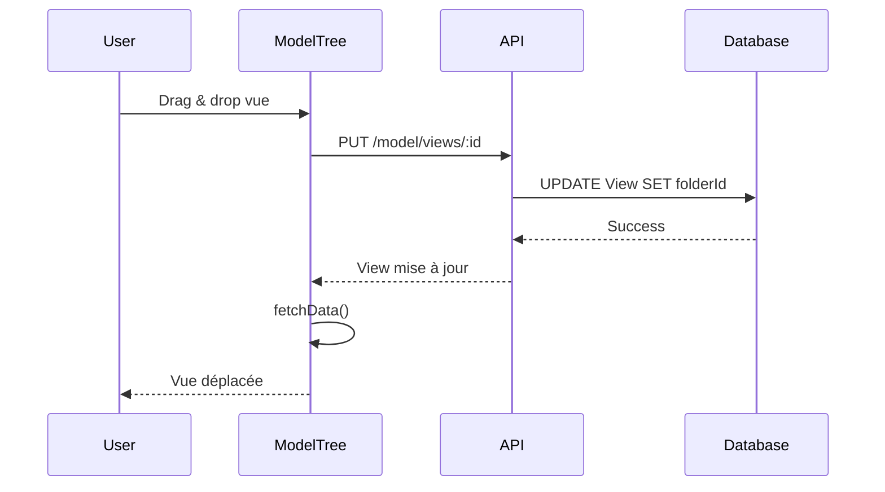

# Gestion des Vues dans le Repository

## Vue d'ensemble

Les vues créées dans le Studio sont maintenant **persistées dans la base de données** et apparaissent dans le **Repository (ModelTree)**. Elles peuvent être **déplacées entre dossiers** par drag & drop et **ouvertes dans des onglets**.

## Fonctionnalités

### ✅ Implémenté

#### 1. **Création de vues persistées**
- Cliquer sur le bouton "+" crée une nouvelle vue dans la base de données
- La vue est automatiquement ajoutée au Repository
- La vue s'ouvre dans un nouvel onglet

#### 2. **Affichage dans le Repository**
- Les vues apparaissent sous leurs dossiers parents
- Icône distinctive (Layout) pour les vues
- Nom de la vue affiché

#### 3. **Ouverture depuis le Repository**
- Cliquer sur une vue l'ouvre dans un nouvel onglet
- Si la vue est déjà ouverte, l'onglet existant est activé
- Pas de duplication d'onglets

#### 4. **Drag & Drop des vues**
- Les vues sont draggables
- Peuvent être déplacées entre dossiers
- Mise à jour automatique dans la base de données

#### 5. **Renommage des vues**
- Bouton "Rename" au survol de la vue
- Renommage via prompt
- Synchronisation avec la base de données et les onglets ouverts

---

## Architecture

### Backend

#### API Endpoints

**Créer une vue** :
```http
POST /model/views
Content-Type: application/json

{
  "name": "Ma Vue",
  "modelPackageId": "pkg-123",
  "folderId": "folder-456",
  "content": {}
}
```

**Mettre à jour une vue** :
```http
PUT /model/views/:id
Content-Type: application/json

{
  "name": "Nouveau nom",
  "folderId": "new-folder-id"
}
```

**Récupérer une vue** :
```http
GET /model/views/:id
```

#### Schéma Prisma

```prisma
model View {
  id             String         @id @default(uuid())
  name           String
  description    String?
  content        Json?          // Layout data (nodes, edges, positions)
  modelPackageId String
  modelPackage   ModelPackage   @relation(fields: [modelPackageId], references: [id])
  folderId       String?
  folder         Folder?        @relation(fields: [folderId], references: [id])
  createdAt      DateTime       @default(now())
  updatedAt      DateTime       @updatedAt
}
```

---

### Frontend

#### Store Zustand - useTabsStore

**Nouvelles fonctions** :

```typescript
// Créer une vue avec persistance
addTabWithPersistence: (name: string, packageId: string, folderId?: string) => Promise<ViewTab>

// Ouvrir une vue depuis le repository
openViewFromRepository: (viewId: string, viewName: string, packageId: string, folderId?: string) => void

// Mettre à jour le dossier d'une vue
updateTabFolder: (tabId: string, folderId: string | null) => Promise<void>
```

**Interface ViewTab** :

```typescript
interface ViewTab {
  id: string;
  viewId: string;
  viewName: string;
  packageId: string;
  folderId?: string;
  isPersisted: boolean; // Indique si la vue existe en BDD
}
```

#### ModelTree

**Fonctions ajoutées** :

```typescript
// Renommer une vue
handleRenameView: (viewId: string, currentName: string) => Promise<void>

// Drag & drop des vues (intégré dans handleDrop)
```

**Affichage des vues** :

```tsx
{folder.views?.map((view: ViewType) => (
  <div
    draggable
    onDragStart={(e) => {
      e.dataTransfer.setData('application/archimodeler-view', JSON.stringify({ viewId: view.id }));
    }}
    onClick={() => {
      useTabsStore.getState().openViewFromRepository(view.id, view.name, packageId, folder.id);
    }}
  >
    <Layout className="h-3.5 w-3.5 text-primary" />
    <span>{view.name}</span>
    <button onClick={() => handleRenameView(view.id, view.name)}>
      <Edit2 />
    </button>
  </div>
))}
```

---

## Utilisation

### Créer une nouvelle vue

1. Cliquer sur le bouton **"+"** dans la barre d'onglets
2. Une nouvelle vue est créée avec le nom "New View X"
3. La vue apparaît dans le Repository
4. La vue s'ouvre dans un nouvel onglet

### Ouvrir une vue existante

1. Naviguer dans le Repository
2. Cliquer sur une vue
3. La vue s'ouvre dans un nouvel onglet
4. Si déjà ouverte, l'onglet existant est activé

### Déplacer une vue

1. Dans le Repository, cliquer et maintenir sur une vue
2. Glisser vers un dossier cible
3. Relâcher pour déposer
4. La vue est déplacée dans le nouveau dossier

### Renommer une vue

**Depuis le Repository** :
1. Survoler la vue
2. Cliquer sur l'icône "Edit"
3. Entrer le nouveau nom
4. Valider

**Depuis un onglet** :
1. Double-cliquer sur l'onglet
2. OU clic droit → Rename
3. Entrer le nouveau nom
4. Valider

---

## Flux de données

### Création d'une vue



### Ouverture depuis le Repository



### Déplacement d'une vue



---

## Tests

### Test 1 : Créer une vue

1. Ouvrir le Studio
2. Cliquer sur "+"
3. **Vérifier** : Nouvel onglet créé
4. **Vérifier** : Vue apparaît dans le Repository
5. Rafraîchir la page
6. **Vérifier** : La vue persiste

**Résultat attendu** : ✅ Vue créée et persistée

---

### Test 2 : Ouvrir une vue

1. Dans le Repository, cliquer sur une vue
2. **Vérifier** : Vue s'ouvre dans un onglet
3. Cliquer à nouveau sur la même vue
4. **Vérifier** : L'onglet existant est activé (pas de duplication)

**Résultat attendu** : ✅ Ouverture correcte

---

### Test 3 : Déplacer une vue

1. Créer un dossier "Test"
2. Glisser une vue vers ce dossier
3. **Vérifier** : La vue apparaît sous "Test"
4. Rafraîchir la page
5. **Vérifier** : La vue est toujours dans "Test"

**Résultat attendu** : ✅ Déplacement persisté

---

### Test 4 : Renommer une vue

1. Survoler une vue dans le Repository
2. Cliquer sur "Edit"
3. Entrer "Ma Vue Renommée"
4. **Vérifier** : Nom mis à jour dans le Repository
5. **Vérifier** : Si la vue est ouverte, l'onglet est mis à jour
6. Rafraîchir la page
7. **Vérifier** : Le nouveau nom persiste

**Résultat attendu** : ✅ Renommage synchronisé

---

## Améliorations futures

### 🔄 À implémenter

1. **Suppression de vues**
   - Bouton "Delete" dans le Repository
   - Fermer l'onglet si la vue est ouverte
   - Confirmation avant suppression

2. **Duplication de vues**
   - Bouton "Duplicate" dans le Repository
   - Copie du contenu de la vue
   - Nom automatique "Copy of X"

3. **Recherche de vues**
   - Filtrer les vues dans le Repository
   - Recherche par nom

4. **Tri des vues**
   - Par nom
   - Par date de création
   - Par date de modification

5. **Icônes personnalisées**
   - Permettre de choisir une icône pour chaque vue
   - Couleurs personnalisées

6. **Métadonnées**
   - Description de la vue
   - Tags
   - Auteur
   - Date de dernière modification

---

## Dépannage

### La vue ne s'affiche pas dans le Repository

**Vérifier** :
- Le backend est démarré
- La vue a bien été créée (vérifier en BDD)
- Le `fetchData()` du ModelTree fonctionne
- Pas d'erreur dans la console

### Le drag & drop ne fonctionne pas

**Vérifier** :
- L'attribut `draggable` est présent
- Le `onDragStart` définit les bonnes données
- Le `onDrop` du dossier cible gère les vues
- Pas d'erreur dans la console

### Le renommage ne se synchronise pas

**Vérifier** :
- L'API `/model/views/:id` fonctionne
- Le `fetchData()` est appelé après le renommage
- Le store des onglets écoute les changements
- Pas d'erreur dans la console

---

## Code Examples

### Créer une vue programmatiquement

```typescript
import { useTabsStore } from '@/store/useTabsStore';

const { addTabWithPersistence } = useTabsStore();

// Créer une nouvelle vue
await addTabWithPersistence('Ma Nouvelle Vue', 'package-id', 'folder-id');
```

### Ouvrir une vue programmatiquement

```typescript
import { useTabsStore } from '@/store/useTabsStore';

const { openViewFromRepository } = useTabsStore();

// Ouvrir une vue existante
openViewFromRepository('view-id', 'Nom de la vue', 'package-id', 'folder-id');
```

### Déplacer une vue programmatiquement

```typescript
import { viewsApi } from '@/lib/api/views';

// Déplacer vers un dossier
await viewsApi.moveToFolder('view-id', 'new-folder-id');

// Déplacer à la racine
await viewsApi.moveToFolder('view-id', null);
```

---

## Résumé

**Les vues sont maintenant complètement intégrées au Repository !**

✅ Création persistée
✅ Affichage dans le Repository
✅ Ouverture dans des onglets
✅ Drag & Drop entre dossiers
✅ Renommage synchronisé

**Les utilisateurs peuvent maintenant organiser leurs vues comme ils le souhaitent ! 🎉**
